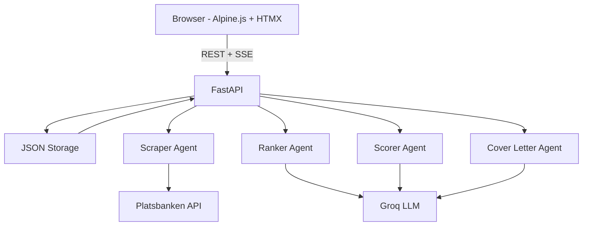
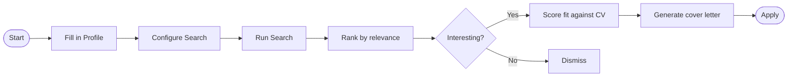
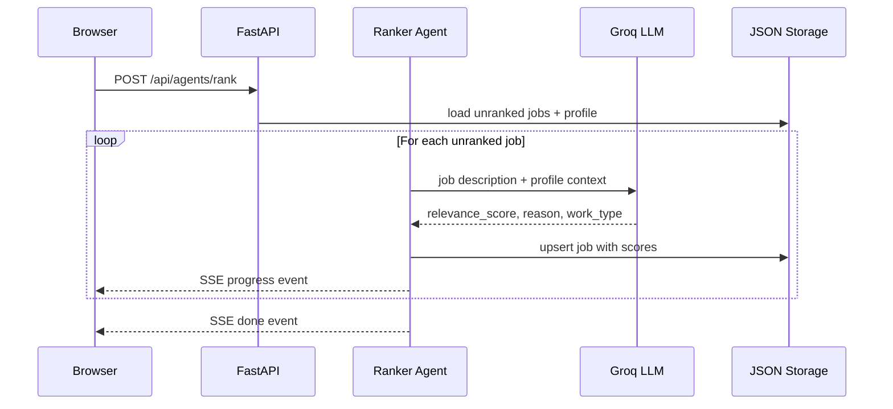

# JobRadar

> AI-powered job search that tells you which listings actually matter.

JobRadar automates the most tedious parts of a job search: fetching listings, scoring them against your profile, evaluating your CV fit, and drafting cover letters — all in one local app with no database to manage.

The focus of this project is the **backend and AI pipeline** — the multi-agent architecture, Groq LLM integration, and SSE streaming. The frontend (Alpine.js + HTMX) is intentionally minimal and functional, not a polished product UI.

---

## What it does

Most job boards return hundreds of listings. JobRadar cuts through the noise in four steps:

1. **Search** — Scrape job listings from configured sources using your keywords and location.
2. **Rank** — An AI agent reads each listing and scores it 0–100 based on how well it matches your profile.
3. **Score fit** — For jobs that look interesting, a second AI agent analyses your CV against the full job description and returns strengths, gaps, and recommendations.
4. **Cover letter** — A third AI agent writes a personalised, language-aware cover letter ready for editing and export.

All AI calls go to [Groq](https://groq.com) (free tier available). Your data stays local — everything is stored as JSON files on your machine.

---

## User guide

### 1. Profile tab

Fill in your details once. This data feeds every AI call.

| Field | What it's used for |
|---|---|
| Desired job title | Default keyword in searches and cover letters |
| Location | Filters search results geographically |
| Years of experience | Context for relevance scoring |
| Summary | Short pitch used by AI when scoring and writing letters |
| Skills | Technologies and competencies to highlight (press Enter or comma to add) |
| CV text / PDF | Pasted or uploaded CV — used for fit scoring and cover letter generation |

### 2. Search tab

Configure what to look for and where.

- **Keywords** — Job titles or technologies (e.g. `Frontend Developer`, `React`). Add multiple.
- **Location** — City or region. Leave empty for country-wide results.
- **Work type** — Filter for remote, hybrid, or on-site. Select multiple.
- **Sources** — Toggle which job boards to search (currently: Platsbanken / JobTech).
- **Max jobs** — Approximate cap on listings per search run.

Click **Start search** to fetch listings. Progress streams live to the page.

### 3. Jobs tab

All fetched listings appear here. Use the toolbar to filter by status, minimum relevance score, or work type.

**Ranking** runs separately from searching — search is instant scraping with no AI. Click **Rank by relevance** to have the AI score every unranked listing against your profile and keywords. A progress log streams each result in real time.

Jobs show three badges:
- **Work type** (remote / hybrid / on-site / ?) — detected from the listing
- **Relevance score** (0–100) — how well the job matches your profile
- **Fit score** (0–100) — how well your CV matches this specific job (run separately)

### 4. Job detail panel

Click any listing to open the detail panel.

- **Relevance reason** — AI explanation of the relevance score
- **Fit breakdown** — strengths, gaps, and recommendations from CV scoring
- **Status** — Mark as New / Interesting / Applied / Dismissed
- **Notes** — Free-text notes stored with the job
- **Score fit against CV** — Runs the CV scoring agent for this job
- **Generate cover letter** — Opens a hints dialog (optional extra instructions), then generates a personalised letter
- **Open posting** — Link to the original job board listing

### 5. Cover letter panel

The generated letter opens in an editable panel. Changes auto-save after 1 second of inactivity.

- **Export TXT** — Download as plain text
- **Export PDF** — Download as formatted PDF
- **Regenerate** — Re-run the agent with new hints

---

## Setup

### Requirements

- Python 3.14 or higher
- [UV package manager](https://docs.astral.sh/uv/)
- A [Groq API key](https://console.groq.com) (free tier is sufficient)

### Install

```bash
git clone <repo-url>
cd job-radar
uv sync
```

### Configure

Copy the example environment file and fill in your Groq API key:

```bash
cp .env.example .env
```

Edit `.env`:

```env
GROQ_API_KEY=your_groq_api_key_here
```

### Run

```bash
PYTHONUTF8=1 uv run fastapi dev src/main.py
```

Open [http://localhost:8000](http://localhost:8000) in your browser.

On Windows (PowerShell):

```powershell
$env:PYTHONUTF8 = "1"; uv run fastapi dev src/main.py
```

---

## Configuration

All settings via environment variables (or `.env` file):

| Variable | Default | Description |
|---|---|---|
| `GROQ_API_KEY` | *(required)* | Groq API key |
| `GROQ_MODEL` | `llama-3.3-70b-versatile` | LLM model to use |
| `DATA_DIR` | `./data` | Directory for JSON storage and cover letters |
| `HOST` | `127.0.0.1` | Server bind address |
| `PORT` | `8000` | Server port |

---

## Architecture

### System overview



### User workflow



### Agent pipeline (example: ranking)



### Directory structure

```
src/
├── main.py               ← FastAPI app, router registration, static file serving
├── config.py             ← Settings (Pydantic BaseSettings, reads .env)
├── models.py             ← Data models: Job, Profile, SearchConfig, AppSettings
├── storage.py            ← JSON read/write helpers (no database)
├── agents/
│   ├── scraper.py        ← Fetches listings from job sources
│   ├── ranker.py         ← Relevance scoring + work type detection
│   ├── scorer.py         ← CV-fit analysis (strengths, gaps, recommendations)
│   └── cover_letter.py   ← Personalised cover letter generation
├── sources/
│   ├── base.py           ← BaseJobSource ABC
│   └── platsbanken.py    ← JobTech API (Swedish public job board)
└── routers/
    ├── settings.py       ← GET/PUT /api/settings
    ├── profile.py        ← GET/PUT /api/profile, POST /api/profile/cv/upload
    ├── search_config.py  ← GET/PUT /api/search-config
    ├── jobs.py           ← GET/PATCH/DELETE /api/jobs
    ├── agents.py         ← POST /api/agents/{scrape,rank,score,cover-letter}
    └── cover_letters.py  ← GET/PUT /api/cover-letters/{id}, export endpoints

static/
├── index.html            ← Single-page app (Alpine.js + HTMX, no build step)
├── style.css
└── i18n/                 ← Translation files (en, sv, de, fr, es, pl)

data/                     ← Auto-created, gitignored
├── jobs.json
├── profile.json
├── search_config.json
├── settings.json
└── cover_letters/
```

All agent endpoints return [Server-Sent Events](https://developer.mozilla.org/en-US/docs/Web/API/Server-sent_events) for live streaming. Each event is a JSON object:

```
data: {"type": "progress", "message": "Ranked: Senior Frontend Developer @ ACME (87)"}\n\n
data: {"type": "done", "job_id": "abc123", "relevance_score": 87}\n\n
data: {"type": "error", "message": "Rate limit hit, retrying..."}\n\n
```

---

## Adding a job source

Implement `BaseJobSource` in `src/sources/`:

```python
from src.sources.base import BaseJobSource
from src.models import Job

class MySource(BaseJobSource):
    name = "mysource"

    async def search(self, keywords, location, work_type, max_jobs):
        # fetch from your API, yield Job objects
        async for job in fetch_from_api(keywords, location):
            yield Job(source=self.name, ...)
```

Then register it in `src/agents/scraper.py` alongside the existing sources. No changes to routers or agents needed.

---

## API reference

Interactive docs are available at [http://localhost:8000/docs](http://localhost:8000/docs) when the server is running.
